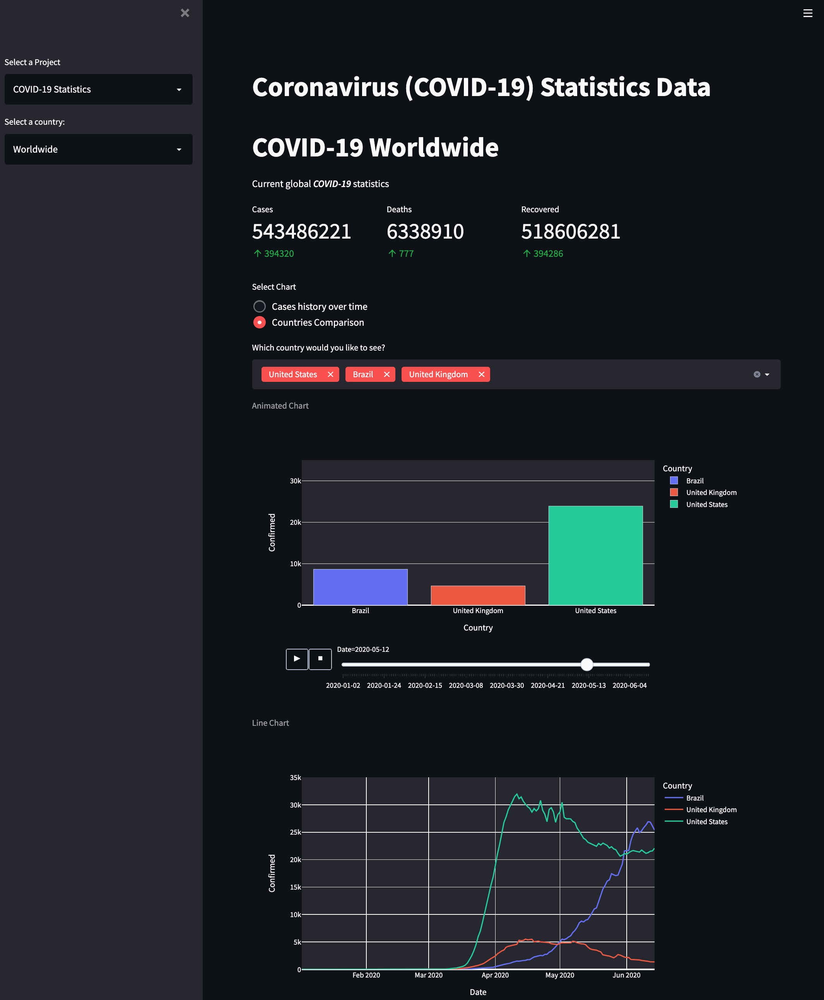

# Streamlit

[You can reach the application here.](https://share.streamlit.io/lsoca007/streamlit/main.py)

___

## Introduction

The COVID-19 pandemic continues to impact countries around the world. Many people are still being infected, and the number of new coronavirus cases around the world is fluctuating. Several COVID-19 vaccines have been authorized for use in several countries, and immunization campaigns are currently underway. Nonetheless, it is critical for the people to remain cautious, take safety precautions, and observe all rules and regulations.

This is an app that shows the most recent data available on total cases, deaths, and recovered cases.

For general information including symptoms, testing, and community safety, visit https://www.cdc.gov.

### Resources
https://disease.sh/
https://ourworldindata.org/epi-curve-covid-19

